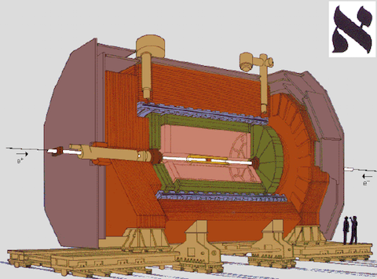
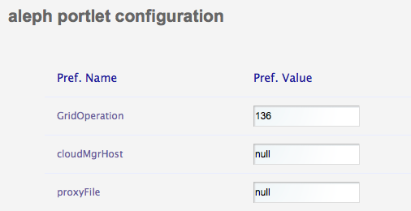
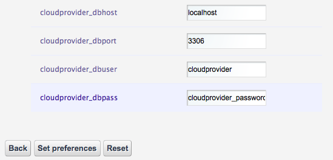

*********************
Aleph
*********************

============
About
============

-------------

ALEPH was a particle physics experiment installed on the Large Electron-Positron collider (LEP) at the CERN laboratory in Geneva/Switzerland. It was designed to explore the physics predicted by the Standard Model and to search for physics beyond it. ALEPH first measured events in LEP in July 1989. LEP operated at around 91 GeV – the predicted optimum energy for the formation of the Z particle. From 1995 to 2000 the accelerator operated at energies up to 200 GeV, above the threshold for producing pairs of W particles. The data taken, consisted of millions of events recorded by the ALEPH detector,allowed precision tests of the electro-weak Standard Model (SM) to be undertaken. The group here concentrated our analysis efforts mainly in Heavy Flavour (beauty and charm) physics, in searches for the the Higgs boson, the particles postulated to generate particle mass, and for physics beyond the SM, e.g. Supersymmetry, and in W physics.
This application perform the search for the production and non-standard decay of a scalar Higgs boson into four tau leptons through the intermediation of the neutral pseudo-scalars Higgs particle. 
The analysis was conducted by the ALEPH collaboration with the data collected at centre-of-mass energies from 183 to 209 GeV.

============
Installation
============
Following instructions are meant for science gateway maintainers while generic users can skip this section.
To install the portlet it is enough to install the war file into the application server and then configure several settings into the portlet preferences pane.
Preferences have the form of a set of couples (key,value). The meaning of each key will be described below:

.. table:: Preferences 

   =====  =====
   Key    Value
   =====  =====
   'Grid Operation' 'Value used by the GridEngine to register user activity on the DCI'
   'cloudMgrHost' 'Unused'
   =====  =====

GridOperation   
cloudMgrHost    
proxyFile   
eTokenHost  
eTokenPort  
eTokenMd5Sum    
eTokenVO    
eTokenVOGroup   
eTokenProxyRenewal  
alephGroupName  
guacamole_dir   
guacamole_noauthxml 
guacamole_page  
iservices_dbname    
iservices_dbhost    
iservices_dbport    
iservices_dbuser    
iservices_dbpass    
iservices_srvname   
cloudprovider_dbname    
cloudprovider_dbhost    
cloudprovider_dbport    
cloudprovider_dbuser    
cloudprovider_dbpass    

Actually, depending on the infrastructure, some of the fields above have an overloaded meaning. Please contact the support for further information or watch existing production portlet settings.

============
Usage
============
The usage of the portlet is simple; the user can select to upload a local R macro file selecting the Browse button in the **Application input file** section, or insert inside the text field the R macro text by pasting a text or editing directly on the larger text box below.
The **job identifier** text is a human readable values that users will use to keep track of any job execution.
Following buttons: Demo, Submit, Reset values and About are respectively:

 *Demo* - Fills the Macro Text box with an R-Macro example

 *Submit* - Executes the given macro on the distributed infrastructure

 *Reset* - Resets the input form

 *About* - Gives an overview of the portlet

.. image:: images/input.png

============
Support
============
To get support such as reporting a bug, a problem or even request new features, please contact

.. _INFN: http://www.ct.infn.it/

:Authors:
 
 `Roberto BARBERA <mailto:roberto.barbera@ct.infn.it>`_ - Italian National Institute of Nuclear Physics (INFN_),
 
 `Riccardo BRUNO <mailto:riccardo.bruno@ct.infn.it>`_ - Italian National Institute of Nuclear Physics (INFN_),

 
:Version: v1.0

